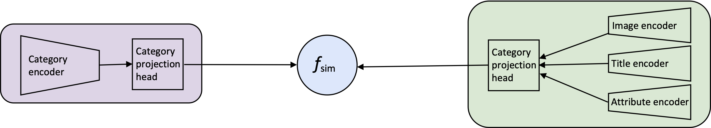

# Extending CLIP for Category-to-image Retrieval in E-commerce

This repository contains the code used for the experiments in "[Extending CLIP for Category-to-image Retrieval
in E-commerce](https://mariyahendriksen.github.io/files/ecir22.pdf)" published at ECIR 2022.

<div align="center">

  [](https://arxiv.org/abs/2112.11294)
  [](https://pytorch.org/)
  [](https://opensource.org/licenses/MIT)
</div>



## License
The contents of this repository are licensed under the MIT license. If you modify its contents in any way, please link back to this repository.


## Reproducing Experiments

First off, install the dependancies:
```bash
pip install -r requirements.txt
```

### Download the data
Download the `CLIP_data.zip` from [this repository](https://zenodo.org/record/7298031#.Y2jgU-zMLtV). 


After unzipping `CLIP_data.zip` put the resulting `data` folder in the root:

```angular2html
data/
    datasets/
    results/
```


### Evaluate the model

```bash
sh jobs/evaluation/evaluate_cub.job
sh jobs/evaluation/evaluate_abo.job
sh jobs/evaluation/evaluate_fashion200k.job
sh jobs/evaluation/evaluate_mscoco.job
sh jobs/evaluation/evaluate_flickr30k.job
# printing the results for CLIP in one file
sh jobs/postprocessing/results_printer.job
```


## Citing and Authors
If you find this repository helpful, feel free to cite our paper "[Extending CLIP for Category-to-image Retrieval
in E-commerce](https://mariyahendriksen.github.io/files/ecir22.pdf)":

```latex
@inproceedings{hendriksen-2022-extending-clip,
author = {Hendriksen, Mariya and Bleeker, Maurits and Vakulenko, Svitlana and van Noord, Nanne and Kuiper, Ernst and de Rijke, Maarten},
booktitle = {ECIR 2022: 44th European Conference on Information Retrieval},
month = {April},
publisher = {Springer},
title = {Extending CLIP for Category-to-image Retrieval in E-commerce},
year = {2022}}
```

